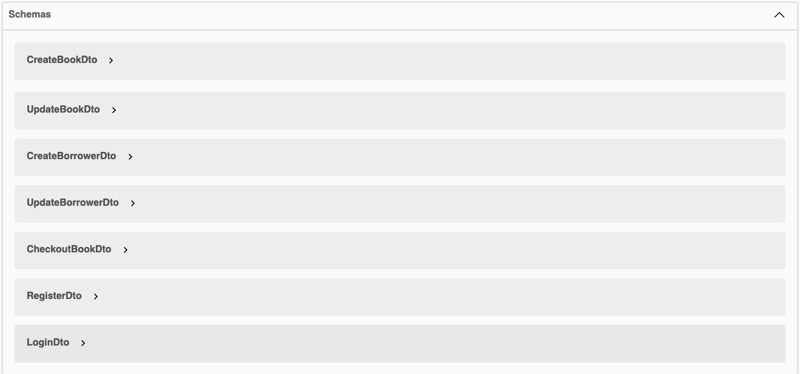
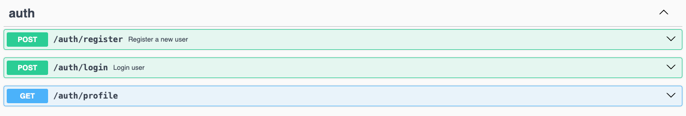
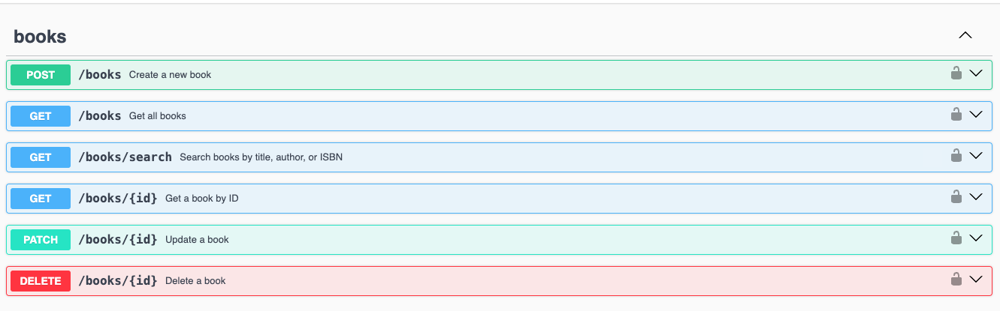
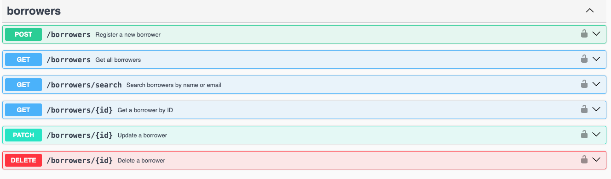
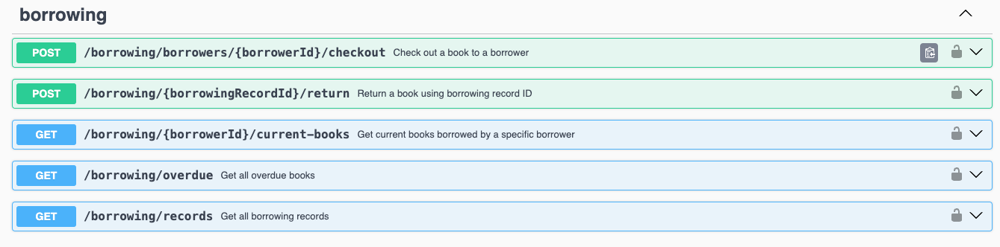

# 📚 Library Management System

A comprehensive RESTful API for managing library books, borrowers, and borrowing processes built with **NestJS**, **PostgreSQL**, and **Docker**.

## 📋 Table of Contents

- [Features](#-features)
- [Tech Stack](#-tech-stack)
- [Quick Start](#-quick-start)
- [Setup Options](#-setup-options)
- [API Documentation](#-api-documentation)
- [Authentication](#-authentication)
- [Core Features](#-core-features)
- [Bonus Features](#-bonus-features)
- [Database Schema](#-database-schema)
- [Testing](#-testing)
- [Pre-loaded Test Data](#-pre-loaded-test-data)

## ✨ Features

### Core Functionality

- **📖 Book Management**: Add, update, delete, list, and search books
- **👥 Borrower Management**: Register, update, delete, and list borrowers
- **🔄 Borrowing Process**: Check out books, return books, track due dates
- **⏰ Overdue Tracking**: Automatic overdue book detection and reporting

### Advanced Features

- **🔐 JWT Authentication**: Secure API access with role-based authentication
- **📊 Analytics & Reports**: Borrowing analytics with date range filtering
- **📁 Data Export**: Export reports in CSV and Excel formats
- **🛡️ Rate Limiting**: API abuse prevention on critical endpoints
- **🔍 Advanced Search**: Case-insensitive search across multiple fields
- **📈 Performance Optimization**: Database indexing for fast queries

## 🛠 Tech Stack

- **Backend**: Node.js, NestJS, TypeScript
- **Database**: PostgreSQL with TypeORM
- **Authentication**: JWT (JSON Web Tokens)
- **Documentation**: Swagger/OpenAPI
- **Containerization**: Docker & Docker Compose
- **Testing**: Jest
- **Validation**: class-validator
- **Rate Limiting**: @nestjs/throttler

## 🚀 Quick Start

The fastest way to get started:

```bash
git clone <repository-url>
cd library-management-system
./setup.sh
```

That's it! The application will be running at `http://localhost:3000` with pre-loaded test data.

## ⚙️ Setup Options

### Option 1: Full Docker Setup (Recommended)

```bash
# Start everything with one command
docker-compose up --build

# Or use the setup script
chmod +x setup.sh
./setup.sh
```

**What you get:**

- ✅ PostgreSQL database
- ✅ NestJS application
- ✅ Pre-loaded test data
- ✅ Hot reloading enabled

**Access:**

- API: `http://localhost:3000`
- Swagger Docs: `http://localhost:3000/api/docs`

### Option 2: Docker Database Only

```bash
# Start only the database
docker-compose up postgres -d

# Install dependencies and start app locally
npm install --legacy-peer-deps
npm run start:dev
```

## 📚 API Documentation

### Swagger UI

**Interactive API documentation** is available at: `http://localhost:3000/api/docs`

**Purpose**: Swagger provides a complete interactive interface where you can:

- 🔍 **Explore all endpoints** with detailed descriptions
- 🧪 **Test APIs directly** from the browser
- 📝 **See request/response examples** for each endpoint
- 🔐 **Authenticate once** and test all protected endpoints
- 📊 **Download files** directly from export endpoints

**How to use**:

1. Open `http://localhost:3000/api/docs` in your browser
2. Click "Authorize" and login with: `librarian` / `password123`
3. Explore and test any endpoint with the "Try it out" button
4. All request examples are pre-filled with test data

### Swagger Screenshots

Each endpoint in Swagger includes complete documentation with expected inputs, outputs, response codes, and examples:












### API Overview

| Endpoint                             | Method   | Description                       |
| ------------------------------------ | -------- | --------------------------------- |
| `/auth/login`                        | POST     | User authentication               |
| `/books`                             | GET/POST | List and create books             |
| `/books/search`                      | GET      | Search books by title/author/ISBN |
| `/borrowers`                         | GET/POST | List and register borrowers       |
| `/borrowing/borrowers/:id/checkout`  | POST     | Check out book to borrower        |
| `/borrowing/records/:id/return`      | POST     | Return book using record ID       |
| `/borrowing/overdue`                 | GET      | Get all overdue books             |
| `/reports/export/overdue-last-month` | GET      | Download overdue books report     |

## 🔐 Authentication

The API uses **JWT (JSON Web Tokens)** for secure access. All endpoints except login/register require authentication.

**Test Credentials**: `librarian` / `password123`

## 🎯 Core Features

### 📖 Books Management

- ✅ **Add books** with title, author, ISBN, quantity, shelf location
- ✅ **Update book details** including availability
- ✅ **Delete books** with validation
- ✅ **List all books** with pagination support
- ✅ **Search books** by title, author, or ISBN (case-insensitive)
- ✅ **Inventory tracking** with available vs total quantities

### 👥 Borrowers Management

- ✅ **Register borrowers** with name, email, registration date
- ✅ **Update borrower information**
- ✅ **Delete borrowers** with active loan validation
- ✅ **List all borrowers**
- ✅ **Search borrowers** by name or email

### 🔄 Borrowing Process

- ✅ **Check out books** with automatic due date calculation (14 days)
- ✅ **Return books** using borrowing record ID
- ✅ **Track current loans** per borrower
- ✅ **Prevent duplicate checkouts** by same borrower
- ✅ **Inventory management** with automatic quantity updates
- ✅ **Overdue detection** with automatic calculation

## 🎁 Bonus Features

### 📊 Analytics & Reporting

- ✅ **Borrowing analytics** for specific time periods
- ✅ **Overdue book reports** with detailed information
- ✅ **Export functionality** in CSV and Excel formats
- ✅ **Date range filtering** for historical data

### 🛡️ Security & Performance

- ✅ **Rate limiting** on login (5 attempts/minute) and search (20/minute)
- ✅ **Input validation** with comprehensive error handling
- ✅ **SQL injection prevention** through TypeORM
- ✅ **Database indexing** for optimized search performance

### 🐳 DevOps & Testing

- ✅ **Full Docker containerization** with docker-compose
- ✅ **Hot reloading** in development environment
- ✅ **Comprehensive unit tests** for Books module
- ✅ **Database seeding** with realistic test data

## 🗄️ Database Schema

The system uses a normalized PostgreSQL schema with proper relationships:

```
┌─────────────┐    ┌──────────────────┐    ┌─────────────┐
│    Books    │    │ BorrowingRecords │    │  Borrowers  │
├─────────────┤    ├──────────────────┤    ├─────────────┤
│ id (UUID)   │◄──┤ book_id (FK)     │   ┌┤ id (UUID)   │
│ title       │    │ borrower_id (FK) ├──►│ name        │
│ author      │    │ checkout_date    │    │ email       │
│ isbn        │    │ due_date         │    │ reg_date    │
│ total_qty   │    │ return_date      │    └─────────────┘
│ avail_qty   │    └──────────────────┘
│ shelf_loc   │
└─────────────┘
```

### Key Features:

- **UUID primary keys** for better scalability
- **Proper foreign key relationships**
- **Indexed fields** for search performance
- **Audit timestamps** on all entities
- **Nullable return_date** for active loans

## 🧪 Testing

### Running Tests

```bash
# Unit tests
npm run test

# Specific module tests
npm run test -- --testPathPattern=books

# Test coverage
npm run test:cov
```

### Test Coverage

- ✅ **Books Service**: CRUD operations, validation, error handling
- ✅ **Books Controller**: Endpoint testing, authentication
- ✅ **Mock implementations** for database operations
- ✅ **Error scenario testing**

## 📊 Pre-loaded Test Data

The system comes with realistic test data:

- **👤 1 User accounts**: `librarian/password123`
- **📚 5 Books**: Classic literature with varying availability
- **👥 4 Borrowers**: Registered library members
- **📋 5 Borrowing records**: Including 2 overdue books for testing
- **📈 Ready for reports**: Data spans multiple months for analytics
